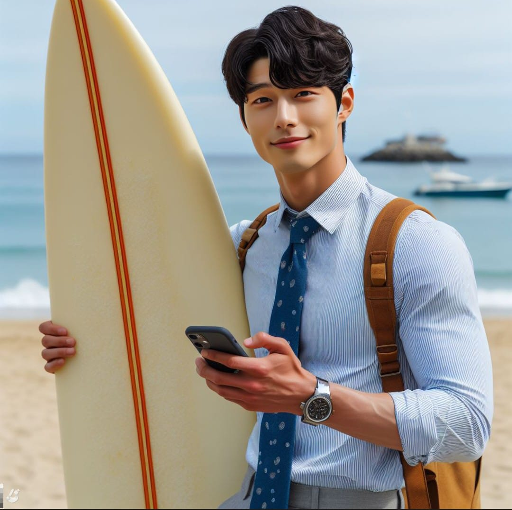
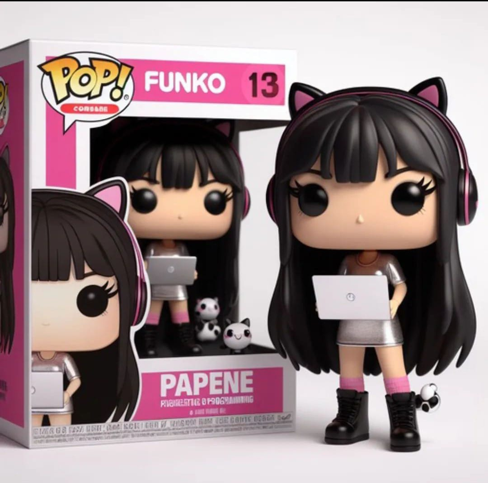
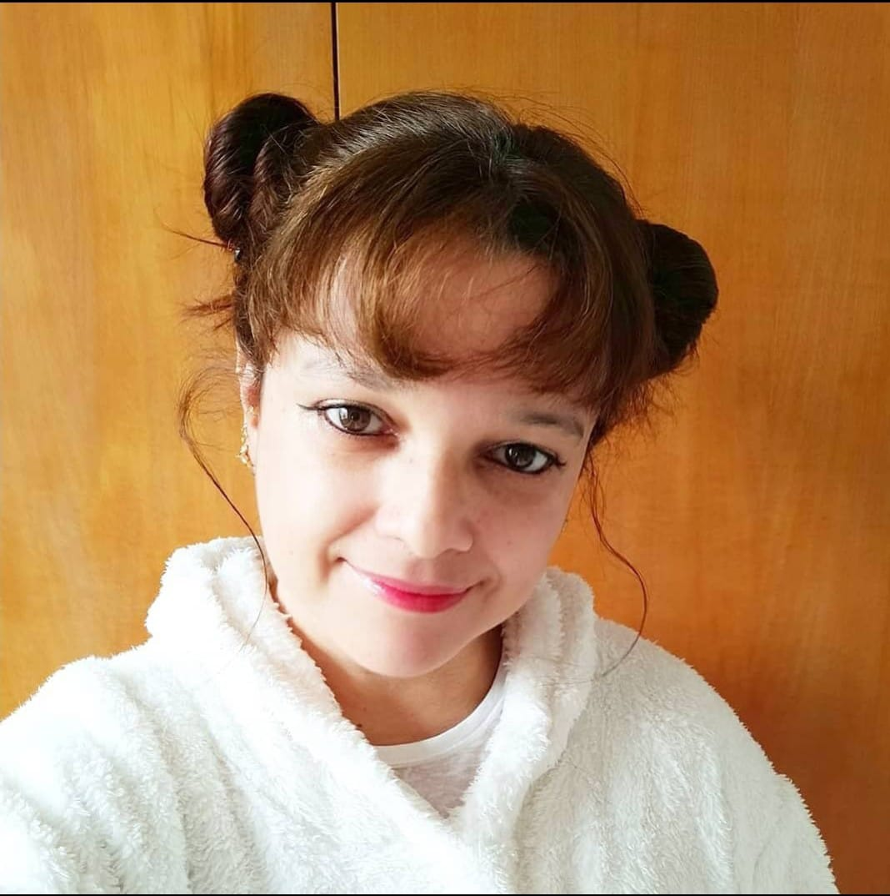
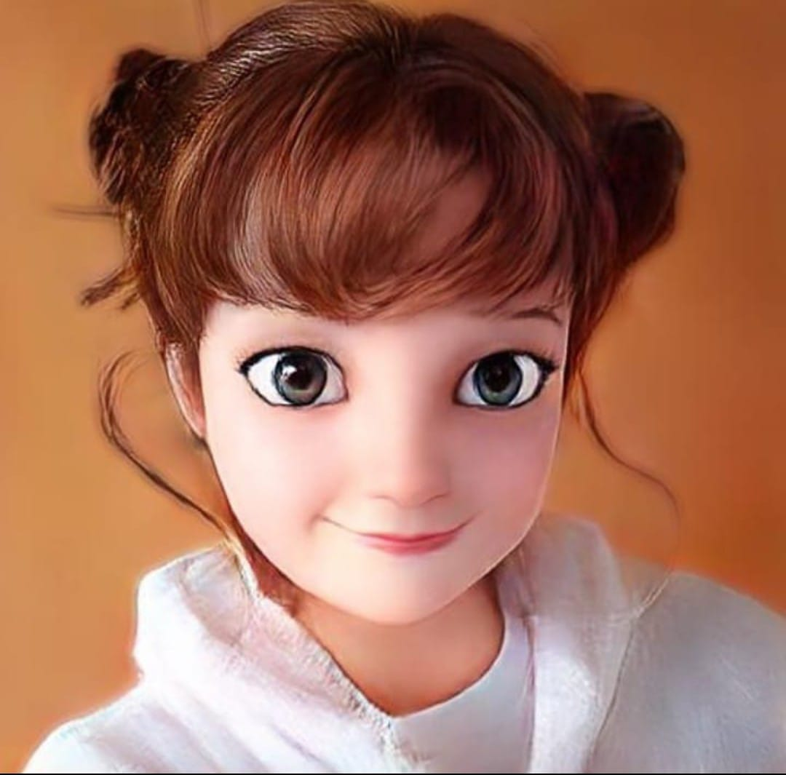
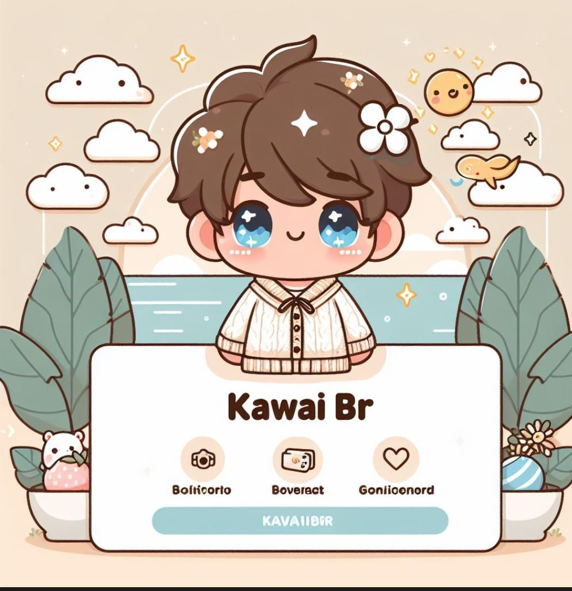

# Natural ou Fake Natty? Como Vencer na Era das IAs Generativas

## 🚀 Introdução

Olá pessoal, Venilton da DIO aqui! Inspirado na hype _"Natty or Not"_ do fisiculturismo, este Lab da DIO te convida a conhecer o mundo das IAs Generativas, explorando o potencial dessas tendências tecnológicas incríveis!

### Template

```markdown

## 📒 Descrição
Breve descrição do seu projeto

## 🤖 Tecnologias Utilizadas
Microsoft Copilot
Microsoft Designer
App 3D Models
ChatGPT

## 🧐 Processo de Criação
Para o desafio Fake Natty, pedi ao copilot que gerasse um personagem de dorama surfista.
<p align="center">

</p>
<p align="center">

</p>

No segundo, através da Microsoft designer, descrevi como sou e do que eu gosto, e ele então gerou o funko pop.

<p align="center">

</p>

No terceiro, através de uma foto real minha, o app gerou em forma de desenho em 3D.

<p align="center">

</p>

<p align="center">

</p>
No quarto, criei a rede social com ajuda do Copilot e usei os comandos para ele fazer a apresentação.

<p align="center">

</p>

<p align="center">

</p>

[Rosana TSF] (https://github.com/RosanaTSF)