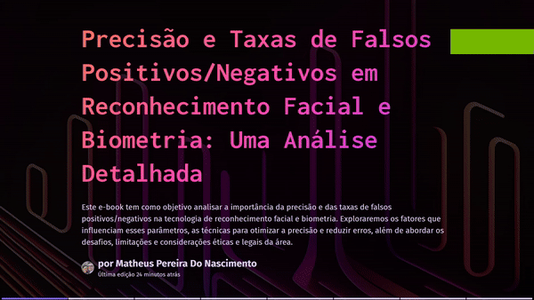

# Reconhecimento Facial e Biometria: Uma Análise Detalhada 🚨

## 📒 Descrição
Este e-book de 8 páginas explora desde de o que são os processos de reconhecimento facial e biometria utilizando IA, até como esses processos muitas vezes podem ter uma taxa de erros na discriminação de um falso positivo/negativo.

## 🤖 Tecnologias Utilizadas
- IA Generativa **[ChatGPT](https://chat.openai.com)** para roteirização;
- IA Generativa **[Gama.app](https://leonardo.ai)** para criar e estruturar todo o e-book;

## 🧐 Processo de Criação
Utilizei o "ChatGPT" para buscar sobre nichos e subnichos sobre a área de tecnologia, onde pedi para que ele me listasse os 20 maiores problemas atuais discutidos na internet, após isso pedi que me listasse os maiores problemas e possíveis soluções sobre o tema escolhido e abordado no E-book. Por outro lado, utilizei o "Gamma.app" para estrutuar e gerar todo meu E-book, usando todo o conteúdo apresentado no "ChatGPT" e depois revisado por mim. 

## 🚀 Resultados
O E-book apresenta de forma simples como as IA's hoje em dia podem resolver varios problemas, porém nem sempre elas são totalmente precisas naquilo que são programadas a fazer.

[CLIQUE PARA LER O E-BOOK](https://gamma.app/docs/Precisao-e-Taxas-de-Falsos-PositivosNegativos-em-Reconhecimento-F-don7e278p409te9)

## 💭 Reflexão
Criar este e-book foi uma experiência reveladora sobre o potencial criativo das IAs e como elas podem ser aplicadas em diferentes contextos.
