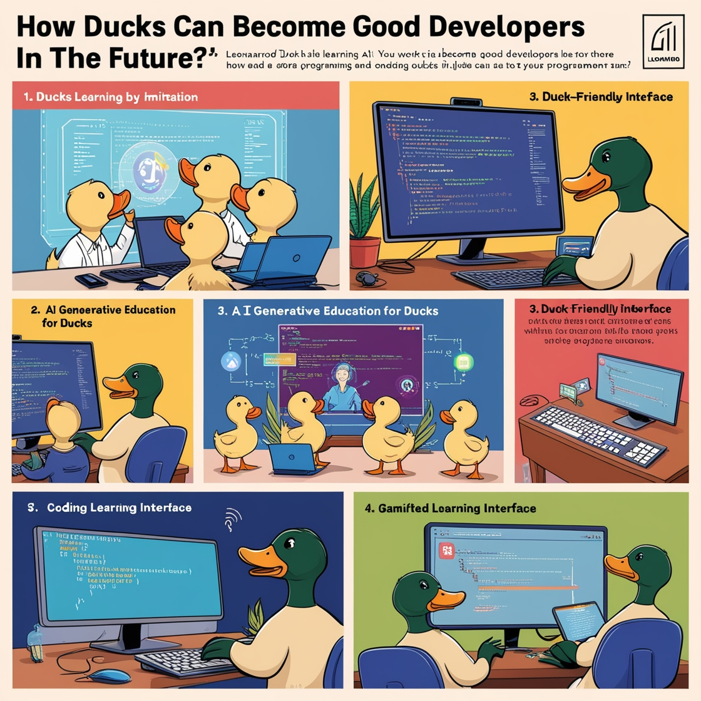

# Como os patos podem se tornar bons devs no futuro!
_Natural ou Fake Natty? Como Vencer na Era das IAs Generativas_

## 📒 Descrição
Artigo fantasioso explorando a capacidade de argumentação das IAs em um cenário improvável e divertido.

## 🤖 Tecnologias Utilizadas
- IA Generatativa: Chat GPT
- IA Generativa: Leonardo AI
- 

## 🧐 Processo de Criação
- Com um assunto em mente, pedi ao ChatGPT que criasse meu artigo.
- Revisei manualmente para confirmar que estava de acordo com o que pedi.
- Com o texto pronto, usei o Leonardo AI para criar algumas ilustrações.

## 🚀 Resultados
- Você pode ver o pdf [aqui](./Article_dev_ducks.pdf) ou o [readme](./article.md)

- 
- 
  

## 💭 Reflexão
Acredito que o uso de IAs deve ser consciente. Elas são ótimas para otimizar tempo, mas o conhecimento para ser bem aproveitado deve ser internalizado no usuário.
