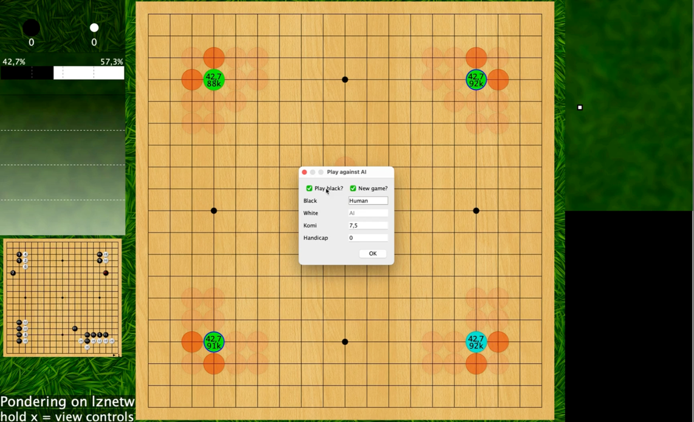
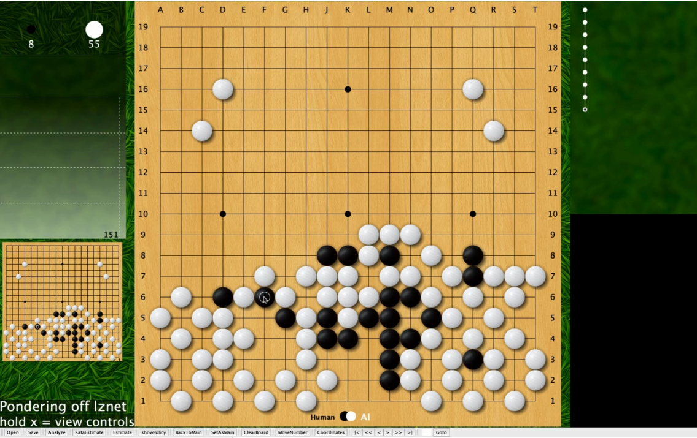

# **Leela** Ai Go | Baduk

Diversos jogos muito conhecidos em todo mundo começaram a ser implementado em algoritmos de redes neurais, dentre eles o Xadrez e o GO.

​	Diversos algoritmos de redes neurais implementam este jogo, dentre eles o AlphaGo da Google, mas para que possamos ter acesso ao código aberto utilizamos outro algoritmo de rede neural que possui o mesmo propósito, a **Leela Zero**, realizamos o download, configuramos na máquina, e realizamos a importação do algoritmo dentro do sabaki criando uma engine, que é um componente de software que tem a finalidade de executar tarefas específicas.

1.Rede de políticas: Onde ele é treinado com jogos de alto nível, ou seja, jogos de profissionais para imitar esses jogadores. 

2.Rede de Valores: Onde ele avalia as posições das peças e dizer qual é a probabilidade de ganhar nessa posição específica.

3.Arvore de busca: Onde ele olha as diferentes variações do jogo tenta descobrir o que vai acontecer no futuro.

**INSTALAÇÃO** 

- Multiambiente(Linux, Windows, Mac) https://lczero.org/play/download/  |  https://github.com/leela-zero/leela-zero
- Recomendado GPU de Alta qualidade
- Já vem pesos bem simples mas funcionais no pacote, pesos mais eficientes, são bem pesados.

**Documentário**

https://www.youtube.com/watch?v=WXuK6gekU1Y

https://www.alphagomovie.com/

Att, Genilson do Carmo
